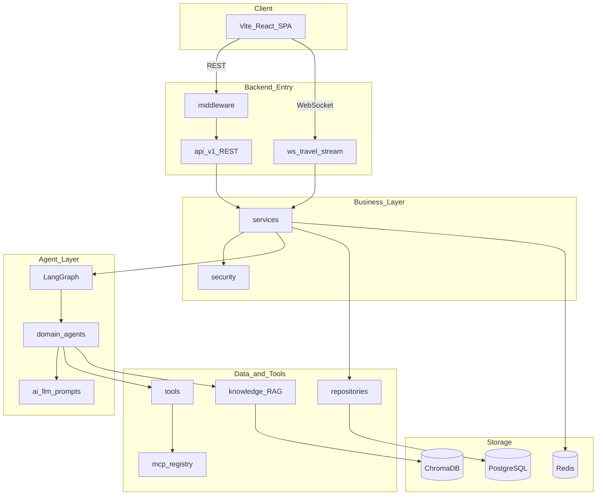
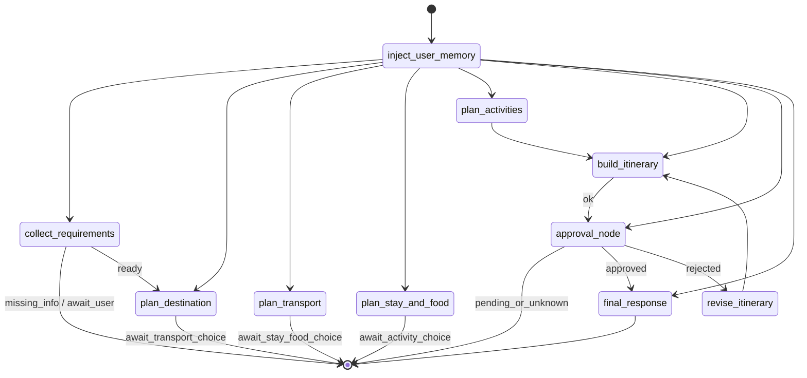
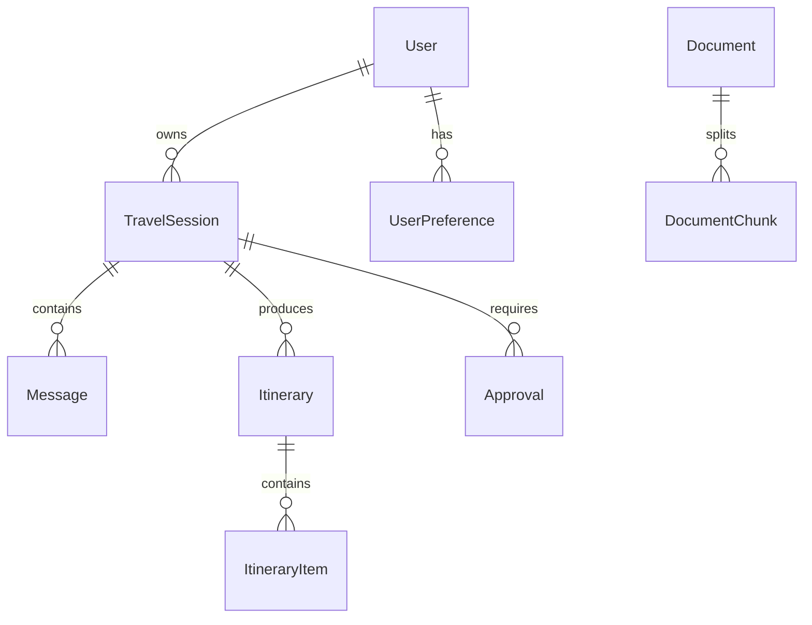

# Travel Agent — 技术架构文档

> 最后更新：2026-06-10  
> 关联文档：[AGENTS.md](../AGENTS.md) | [langgraph_flow.md](langgraph_flow.md) | [api.md](api.md) | [database.md](database.md) | [rag-agent-refactor/09-planning-runtime-blueprint.md](rag-agent-refactor/09-planning-runtime-blueprint.md)

---

## 1. 系统概述

Travel Agent 是一个智能旅行规划平台。V1 线上主路径已切换为 **PlanningRuntime** 九阶段内核；旧 **LangGraph 状态机** 仍可通过 `CHAT_PLANNER_BACKEND=graph` 作为兼容入口保留。

用户通过 Web 界面发起旅行规划会话，系统以 collect → evidence → domain plan → integrate → verify → approval → finalize 流程产出行程与订单。

### 1.1 设计目标

- **可编排**：PlanningRuntime 显式建模九阶段流程；LangGraph 仍可用于 executor / checkpoint 集成
- **可暂停恢复**：RuntimeState 持久化在 `travel_sessions.extra_info.planning_runtime`；collect / approval 多轮 resume
- **可扩展**：工具层与 MCP 层解耦，便于接入新旅行服务
- **可观测**：LangSmith 追踪 LLM 调用链（collect 等阶段）
- **知识增强**：EvidenceEngine 检索 EvidenceCard

---

## 2. 技术栈

### 2.1 后端

| 类别 | 技术 | 版本要求 |
|------|------|----------|
| 语言 | Python | ≥ 3.12（当前 3.13） |
| Web 框架 | FastAPI + Uvicorn | 0.124.x |
| Agent 编排 | LangGraph | 1.x |
| ORM | SQLAlchemy | 2.x |
| 迁移 | Alembic | 1.x |
| 数据库 | PostgreSQL + pgvector | 16 |
| 缓存 | Redis | 7 |
| 向量库 | ChromaDB | 0.5.x |
| LLM | DashScope (Qwen)、DeepSeek、MiMo | OpenAI 兼容接口 |
| Embedding | Qwen text-embedding-v4 | 1024 维 |
| RAG | LangChain Chroma + BM25 + jieba | — |
| MCP | fastmcp + langchain-mcp-adapters | — |
| 认证 | JWT + bcrypt | — |
| 包管理 | uv | — |

### 2.2 前端

| 类别 | 技术 |
|------|------|
| 构建 | Vite |
| UI 框架 | React 18 |
| 语言 | TypeScript |
| 样式 | Tailwind CSS |
| 路由 | React Router |
| 状态 | Zustand |
| 包管理 | pnpm |

### 2.3 基础设施

| 组件 | 用途 |
|------|------|
| Docker Compose | 本地 PostgreSQL + Redis |
| nginx | 生产环境反向代理 |
| LangSmith | LLM 链路追踪 |

### 2.4 第三方服务

| 服务 | 环境变量 | 用途 |
|------|----------|------|
| 通义千问 DashScope | `DASHSCOPE_API_KEY` | 主 LLM + Embedding |
| DeepSeek | `DEEPSEEK_API_KEY` | 备用 LLM |
| 小米 MiMo | `MIMO_API_KEY` | 备用 LLM |
| Tavily | `TAVILY_API_KEY` | 网页搜索 |
| 高德地图 | `AMAP_API_KEY` | 地图/路线/POI |
| AviationStack | `AVIATIONSTACK_API_KEY` | 航班查询 |
| AigoHotel MCP | `AIGOHOTEL_API_KEY` | 酒店查询 |
| 和风天气 QWeather | `QWEATHER_API_KEY` + `QWEATHER_API_HOST` | 天气（主选） |
| LangSmith | `LANGSMITH_API_KEY` | 可观测性 |

---

## 3. 系统架构



---

## 4. 目录结构

```
travel_agent/
├── backend/app/
│   ├── main.py                 # FastAPI 入口
│   ├── settings.py             # 全局配置 (pydantic-settings)
│   ├── dependencies.py         # 依赖注入
│   ├── lifespan.py             # 启动/关闭生命周期
│   ├── middleware/             # CORS、日志、错误、限流
│   ├── api/v1/                 # REST API
│   ├── ws/                     # WebSocket 流式
│   ├── graph/                  # LangGraph 状态机
│   ├── agents/                 # 领域 Agent
│   ├── ai/                     # LLM + Embedding + Prompts
│   ├── tools/                  # 业务工具
│   ├── knowledge/              # RAG 系统
│   ├── mcp/                    # MCP 客户端与适配
│   ├── db/                     # ORM 模型 + Repository
│   ├── services/               # 业务服务
│   ├── schemas/                # Pydantic DTO
│   ├── security/               # JWT + 密码
│   └── utils/
├── frontend/src/               # Vite React SPA
├── data/documents/             # RAG 原始文档
├── infra/                      # Docker + nginx
├── evals/                      # 评测用例
└── docs/                       # 技术文档
```

---

## 5. 请求处理流程

### 5.1 REST 请求

```
Client → middleware (request_id, cors, logging, error_handler)
       → api/v1/router
       → dependencies (auth, db session)
       → services
       → repositories → PostgreSQL
```

### 5.2 WebSocket 流式规划

```
Client → api/v1/chat.stream (SSE) 或 ws/chat_stream
       → services/chat_stream.iter_chat_events()
       → LangGraph astream_events
       → token / step / itinerary / approval_required / done 事件
       → 推送至客户端
```

### 5.3 WS 事件类型

| 事件 | 说明 |
|------|------|
| `step` | 进入某个顶层规划步骤 |
| `tool_call` | 工具调用 |
| `token` | LLM 流式 token |
| `itinerary` | 行程数据更新 |
| `approval_required` | 等待用户确认或提出修改 |
| `error` | 错误信息 |
| `done` | 流程结束 |

---

## 6. LangGraph 规划流程



### 6.1 节点与 Agent 映射

| Graph 节点 | Agent | Prompt |
|------------|-------|--------|
| `inject_user_memory` | — | LangGraph Store 记忆 → `memory_context`（不写入 messages） |
| `collect_requirements` | `planner_agent` | `collect_requirements.md` |
| `plan_destination` | `destination_agent` | `destination_planner.md` |
| `plan_transport` | `transport_agent` | `transport_planner.md` |
| `plan_stay_and_food` | `local_experience_agent` | `local_experience_planner.md` |
| `plan_activities` | `local_experience_agent` | `local_experience_planner.md` |
| `build_itinerary` | `planner_agent` | `itinerary_builder.md` |
| `approval_node` | — | 对话式审批 |
| `revise_itinerary` | `planner_agent` | `revision.md` |
| `final_response` | — | 格式化输出 |
| 质检 | `critic_agent` | `critic.md` |

### 6.2 条件路由

| Router | 职责 |
|--------|------|
| `requirement_router` | 需求是否完整，决定追问或进入规划 |
| `approval_router` | 审批通过/拒绝/超时 |
| `error_router` | 异常降级与重试 |

---

## 7. 分层职责

| 层 | 模块 | 职责 |
|----|------|------|
| 接入层 | `api/`, `ws/`, `middleware/` | HTTP/WS 协议、校验、横切 |
| 业务层 | `services/` | 编排、事务、调用 graph |
| Agent 层 | `graph/`, `agents/` | 状态机、LLM 推理 |
| AI 层 | `ai/` | 模型客户端、Prompt、结构化输出 |
| 工具层 | `tools/`, `mcp/` | 外部能力封装 |
| 知识层 | `knowledge/` | 文档入库与检索 |
| 数据层 | `db/` | ORM + Repository |
| 安全层 | `security/` | 认证授权 |

---

## 8. 数据架构

### 8.1 核心实体



### 8.2 表清单

| 表 | 说明 |
|----|------|
| `users` | 用户账号 |
| `travel_sessions` | 规划会话 |
| `messages` | 聊天消息 |
| `itineraries` | 行程方案 |
| `itinerary_items` | 行程条目 |
| `approvals` | 审批记录 |
| `user_preferences` | 用户偏好 |
| `documents` | RAG 文档元数据 |
| `document_chunks` | 文档切片 |

> Checkpoint 由 `langgraph-checkpoint-postgres` 管理，不落业务表。

---

## 9. RAG 知识系统

```
data/documents/ → knowledge/loader → splitter → embeddings
                                              → vectorstore (ChromaDB)
                                              → document + document_chunk (PostgreSQL 元数据)
```

检索流程：

```
Agent 查询 → retriever (向量 + BM25 混合) → reranker → 返回上下文
```

文档分类目录：

- `destinations/` — 目的地攻略
- `transport/` — 交通指南
- `accommodation/` — 住宿信息
- `food/` — 美食推荐
- `policies/` — 签证/入境政策

---

## 10. MCP 集成架构

```
tools/xxx.py
  → mcp/registry.py (查找已注册工具)
    → mcp/adapters/xxx_adapter.py
      → mcp/client.py → 外部 MCP Server
```

前期 MCP 与 backend 同进程；后期可通过 `infra/docker/mcp.Dockerfile` 独立部署。

详见 [mcp.md](mcp.md)。

---

## 11. 前端架构

```
main.tsx → App.tsx → routes/index.tsx
                    → pages/ (当前主页 + 设置页)
                    → components/ (layout, chat, travel, approval, ui)
                    → hooks/ (useTravelStream, useApproval, ...)
                    → stores/ (zustand)
                    → lib/ (api, websocket, auth, config)
```

### 11.1 页面路由

| 路径 | 页面 | 功能 |
|------|------|------|
| `/` | HomePage | 聊天主页（含会话列表与行程面板） |
| `/settings` | SettingsPage | 用户设置 |

> 认证当前由 `AuthOverlay` 在未登录状态覆盖展示，不使用独立 `/login` 路由。Dashboard、独立会话详情、独立行程详情页面属于后续扩展方向。

### 11.2 开发代理

Vite dev server 代理：

- `/api` → `http://localhost:8200`
- `/ws` → `ws://localhost:8200`

---

## 12. 安全架构

- **认证**：JWT Bearer Token（`security/jwt.py`）
- **密码**：bcrypt 哈希（`security/password.py`）
- **权限**：RBAC 基础（`security/permissions.py`）
- **限流**：Redis + `middleware/security.py`
- **CORS**：`middleware/cors.py` 白名单

---

## 13. 可观测性

| 能力 | 实现位置 |
|------|----------|
| 请求日志 | `middleware/logging.py` + loguru |
| 请求 ID | `middleware/request_id.py` |
| LLM 追踪 | LangSmith（`ai/llm.py` 初始化） |
| 指标 | Prometheus `/metrics`（`main.py` 可选暴露） |
| 错误处理 | `middleware/error_handler.py` |

---

## 14. 部署架构

```
                    ┌─────────┐
                    │  nginx  │
                    └────┬────┘
              ┌──────────┼──────────┐
              ▼                     ▼
      ┌──────────────┐     ┌──────────────┐
      │ frontend:80  │     │ backend:8200 │
      │ (静态文件)    │     │ FastAPI      │
      └──────────────┘     └──────┬───────┘
                                  │
                    ┌─────────────┼─────────────┐
                    ▼             ▼             ▼
              ┌──────────┐ ┌──────────┐ ┌──────────┐
              │ Postgres │ │  Redis   │ │ ChromaDB │
              └──────────┘ └──────────┘ └──────────┘
```

详见 [deployment.md](deployment.md)。

---

## 15. 评测体系

`evals/` 目录包含规划质量评测：

| 用例 | 文件 | 测试场景 |
|------|------|----------|
| 简单行程 | `simple_trip.json` | 基础 3 日游 |
| 缺失信息 | `missing_info.json` | 追问流程 |
| 预算约束 | `budget_trip.json` | 预算内规划 |
| 审批修订 | `approval_revision.json` | interrupt/resume |

执行：`make eval` 或 `uv run python evals/runner.py`

---

## 16. 依赖状态

当前 [pyproject.toml](../pyproject.toml) 已包含 LangGraph、LangGraph Checkpoint、Alembic、FastMCP、ChromaDB 与主要测试依赖。升级这些依赖前需重点关注 LangGraph 1.x 的 API 迁移警告。

---

## 17. 开发环境启动

```bash
# 1. 启动基础设施
make docker-up

# 2. 配置环境变量
cp .env.example .env

# 3. 安装后端依赖
uv sync

# 4. 数据库迁移与 LangGraph 表初始化
make init-db

# 5. 启动后端
make backend

# 6. 启动前端
cd frontend && pnpm install && pnpm dev
```

---

## 18. Spec Kit 集成

本项目使用 GitHub Spec Kit 进行规格驱动开发：

- 配置：`.specify/`
- 宪法：`.specify/memory/constitution.md`
- Cursor Skills：`.cursor/skills/speckit-*`
- 开发约束：[AGENTS.md](../AGENTS.md)

推荐工作流：`/speckit-specify` → `/speckit-clarify` → `/speckit-plan` → `/speckit-tasks` → `/speckit-implement`
