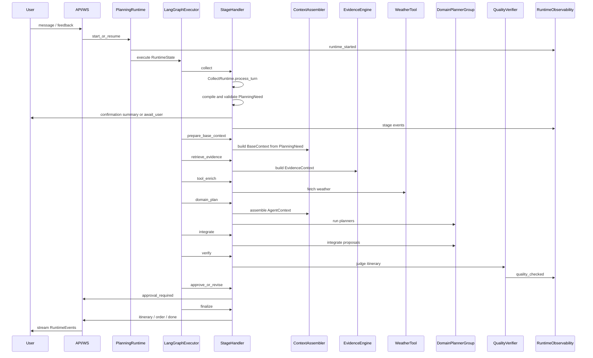

# Planning Runtime Blueprint

> Status: 本文是 RAG Agent Refactor 的 V1 架构蓝图。它定义 PlanningRuntime 新内核、
> V1 主流程和模块边界。若本文与 01-08 中较早的局部流程设计冲突，以本文为准。

## 1. Refactor Positioning

本次重构不再以旧 LangGraph 节点链作为系统主抽象，而是建立新的
`PlanningRuntime` 作为旅行规划系统内核。

LangGraph 在新框架中保留，但定位调整为执行引擎：

```text
Graph 负责“下一步去哪”
Runtime 负责“这一步怎么做”
```

LangGraph 主要承担：

- 阶段编排
- 条件路由
- checkpoint
- streaming
- human-in-the-loop interrupt / resume
- 错误恢复入口

具体业务能力由 Runtime 组件承载：

```text
PlanningRuntime
  -> MemoryManager
  -> ContextAssembler
  -> EvidenceEngine
  -> ToolService
  -> SkillRegistry
  -> AgentRegistry
  -> DomainPlannerGroup
  -> QualityVerifier
  -> Runtime Observability
```

核心目标是把 Travel Agent 从“固定流程 + LLM 节点”升级为可解释、可验证、
可观测、可演进的 Agentic Planning Runtime。

## 2. V1 Demo Closure

V1 需要同时完成两条展示闭环。

### Knowledge Factory Demo

```text
data/documents
  -> knowledge rebuild
  -> SourceDocument / DocumentChunk / EvidenceCard
  -> approved EvidenceCards
  -> Chroma + BM25
  -> knowledge query
  -> inspect-card
```

这条闭环证明长期知识库不是临时拼接的文档检索，而是可生产、可审核、可查询、
可追溯的证据系统。

### Planning Runtime Demo

```text
user input
  -> CollectContext
  -> PlanningNeed
  -> BaseContext
  -> EvidenceContext
  -> ToolContext.weather
  -> DomainPlannerGroup
  -> ItineraryDraft
  -> QualityJudge
  -> approval / revision
  -> FinalResponse / Order
```

这条闭环证明线上旅行规划不是单模型直接生成，而是由 Runtime 管控的多 Agent、
证据驱动、工具增强、多 LLM 验证流程。

## 3. V1 Runtime Flow

V1 主流程定为 9 个阶段：

```text
collect
prepare_base_context
retrieve_evidence
tool_enrich
domain_plan
integrate
verify
approve_or_revise
finalize
```

### collect

`collect` 不是一次性 TripSpec 抽取节点，也不是机械补字段节点，而是可暂停、可恢复、
可循环的对话式需求发现子流程。该阶段可以使用由 approved EvidenceCards 派生的
DestinationDiscoveryCatalog 辅助探索，但不进入正式 Planning Evidence 检索。

内部职责：

```text
user message
  -> CollectSemanticLayer deterministic pre-pass
  -> TripSpecExtractorSkill when needed
  -> merge into CollectContext
  -> DiscoveryHypothesis lifecycle
  -> HybridReadinessEvaluator
  -> ConversationPolicyPlanner
  -> ConversationResponseGenerator
  -> if continue_collect:
       await_user
       -> resume collect
  -> if ready or user requests draft:
       PlanningInputCompiler
       -> PlanningInputValidator
       -> user confirmation summary
       -> PlanningNeed
       -> prepare_base_context
```

`CollectContext` 是 collect 私有的分层工作区：

```text
CollectContext
  trip_spec
  conversation_state
  discovery_state
    proposed / confirmed / rejected / expired hypotheses
  readiness_state
  pending_clarification
  rejected_assumptions
```

只有 `CollectRuntime` 可以完整读取 `CollectContext`。正式 Planner、Integrator 和 Judge
不得直接读取它。`CollectStageHandler` 是 stage facade，内部调用
`CollectRuntime.process_turn()`；LangGraph 只负责跨轮 `await_user / resume collect`
的暂停恢复，不把 collect 内部步骤展开为 graph nodes。

`PlanningNeed` 是 collect 退出到正式规划的唯一输入契约：

```text
PlanningNeed
  confirmed_facts
  derived_facts
  approved_assumptions
  constraints
  preferences
  missing_but_accepted_fields
  risk_flags
```

`PlanningInputCompiler` 只能汇总已确认事实、确定性派生事实、已确认探索假设和用户批准
的 assumptions，不得自行补全缺失事实。`PlanningInputValidator` 校验结构与冲突后，
必须通过用户确认摘要，或记录用户明确要求“先给我做一版”，才能进入正式规划。

#### Greeting First-Turn Experience

首轮寒暄体验是 collect 的特殊路径，不应被新 Runtime 移除。

V1 规则：

```text
first user message
  -> GreetingPolicy
  -> if greeting-only and no previous assistant message:
       emit collect stage public event
       stream greeting reply from GreetingResponder
       persist assistant greeting
       do not enter retrieve_evidence / planning
  -> else:
       continue normal collect
```

目标：

```text
首次进入会话时响应轻量、自然、快速
不为纯寒暄调用规划链路
不污染 TripSpec
不触发 EvidenceEngine / ToolService / DomainPlannerGroup
```

该能力可迁移现有 `build_greeting_reply` / `is_greeting_only_text` 经验，但归属调整为
`CollectStageHandler` 下的 `GreetingPolicy` 和 `GreetingResponder`。

#### Semantic Pipeline Migration

现有 `graph/semantic/semantic_pipeline.py` 不是废弃能力。它负责规范化、槽位绑定、
pending clarification 和规则语义抽取，是多轮 collect 的核心资产。

迁移方式：

```text
old semantic_pipeline
  -> CollectSemanticLayer
  -> TripSpecExtractorSkill deterministic pre-pass
  -> merge into CollectContext
  -> HybridReadinessEvaluator
```

V1 映射：

| 现有能力 | 新 Runtime 归属 |
|----------|-----------------|
| `normalize_text` | `CollectSemanticLayer.normalize` |
| `bind_utterance_to_slots` | `TripSpecExtractorSkill` 的规则前置层 |
| `pending_clarification` | `CollectContext.pending_clarification` |
| `apply_slot_updates` | `CollectStageHandler.merge_trip_spec` |
| `semantic_frame_to_extraction` | `TripSpecExtractorSkill` 输出适配 |
| 节日/日期/天数规则扫描 | collect deterministic helper |

原则：

```text
LLM structured extraction 不替代 semantic rules
semantic rules 先做稳定槽位绑定
LLM 只补足规则无法可靠解析的内容
pending clarification 必须进入 RuntimeState.collect_context
```

这样可以兼容现有多轮收集体验，避免新 `collect` 退化为单次 LLM 抽取。

### prepare_base_context

只接收经过校验的 `PlanningNeed`，读取与本次规划相关的长期偏好、必要会话摘要和历史
决策摘要，生成结构化 `BaseContext`。

该阶段不生成每个 Agent 的完整上下文。Agent 专属上下文在调用前由
`ContextAssembler` 动态组装。`BaseContext` 不是完整 prompt，也不得包含
`CollectContext` 中未确认的探索假设或原始对话过程。

### retrieve_evidence

调用 `EvidenceEngine`，只基于经过校验的 `PlanningNeed` 和允许的 `BaseContext`
过滤条件统一检索本地 EvidenceCards，生成 `EvidenceContext`。

V1 采用“统一先检索，再分发”的策略。各领域 Agent 不自行触发检索。

### tool_enrich

V1 只接入 `WeatherTool` 作为最小真实工具。

天气结果只进入当前 `ToolContext.weather`，不写入长期记忆，不进入 RAG，不生成
EvidenceCard。

### domain_plan

运行 `DomainPlannerGroup`：

```text
DestinationPlanner
  -> RouteTransportActivityPlanner + StayFoodPlanner
```

`DestinationPlanner` 先输出区域和节奏策略，后两个 Agent 并行消费该策略。
`RouteTransportActivityPlanner` 同时负责市内路线、活动组合和交通可行性约束。

### integrate

`ItineraryIntegrator` 拥有最终整合权。它可以合并、取舍、重排、降级建议，但必须
记录原因、证据引用和关键假设。

### verify

`QualityVerifier` 使用独立 Judge 模型检查 `ItineraryDraft + EvidenceContext`。

Judge 有 blocking 否决权。若发现 blocking issue，必须进入修订。

### approve_or_revise

用户可以：

```text
approve
reject
modify_with_feedback
```

修改后根据类型分流：

- 小修改：`RevisionAgent -> verify`
- 修改目的地、天数、预算、同行人：回到 `collect`
- 修改兴趣、必去点、强度：回到 `retrieve_evidence`
- 修改住宿、餐饮、某天活动：回到 `domain_plan` 或 `integrate`

### finalize

`finalize` 是用户旅程的最后一步，不应隐含在 `approve_or_revise` 或自然语言回复里。

职责：

```text
确认 approval_status = approved
生成或复用 order_id
持久化最终 itinerary / itinerary_items
持久化 approval / order link
生成最终用户可见消息
发送 itinerary / order / runtime_completed / done 事件
```

V1 规则：

```text
FinalResponseGenerator 负责最终用户可见消息
OrderService 负责 order_id 生成或复用
ItineraryService 负责最终 itinerary 持久化
RuntimeObservability 记录 finalize 摘要
```

旧系统中 `final_response` 节点直接生成 `ORDER-...`。新 Runtime 中该能力迁移为
`finalize` stage，避免订单、最终回复、前端事件散落在 stream service 或 graph node 中。

## 4. RuntimeState And AgentContext

`RuntimeState` 是一次规划运行中的工作台状态。它保存规范化中间产物，而不是保存
所有 Agent 的完整 prompt 上下文。

V1 `RuntimeState` 应保存：

```text
run_id
session_id
user_id
collect_context
planning_need
base_context
evidence_context
tool_context
decision_context
quality_context
stage_outputs
itinerary_draft
approval_state
revision_count
```

它不应保存：

```text
每个 Agent 的完整上下文
完整 prompt
完整 LLM 原始响应
完整原始聊天历史
完整工具响应
```

`RuntimeState` 是规范化运行产物的工作台，不是权限边界。即使
`collect_context` 存在于 checkpoint 中，也不能把整个 `RuntimeState` 直接传给
Agent。正式规划阶段必须通过 `PlanningNeed + ContextSpec + ContextAssembler` 获取
被允许的上下文视图。

Agent 运行时使用的是临时 `AgentContext`：

```text
allowed RuntimeState sections + ContextSpec + source data
  -> ContextAssembler
  -> AgentContext
  -> Agent / Skill
```

默认情况下，`AgentContext` 不长期存储。V1 只把上下文摘要、证据 id、关键风险写入
Runtime Observability。

## 5. Context Layer

V1 采用 `Context Layer + ContextAssembler`。

底层上下文分为：

```text
CollectContext
PlanningNeed
MemoryContext
BaseContext
EvidenceContext
ToolContext
DecisionContext
QualityContext
```

不同来源分别存储：

```text
Long-term memory  -> user preferences / future memory tables
CollectContext    -> RuntimeState checkpoint, collect-only visibility
PlanningNeed      -> RuntimeState checkpoint, formal planning contract
BaseContext       -> RuntimeState checkpoint, shared planning background
Evidence cards    -> PostgreSQL + Chroma + BM25
Tool results      -> RuntimeState / runtime events summary
DecisionContext   -> RuntimeState summaries + runtime events
QualityContext    -> RuntimeState summaries + runtime events / runtime run summary
```

`ContextAssembler` 是上下文视图生成器，不是长期存储层。它根据每个 Agent 或 Skill
声明的 `ContextSpec` 生成专属上下文，并执行字段级可见性过滤。它不得把
`CollectContext`、完整 RuntimeState、完整聊天历史或工具原始响应透传给正式规划
Agent。

### Formal Fact Provenance

V1 为进入正式规划的上下文事实增加轻量 provenance，而不是为每个原始数据对象建立
复杂统一溯源系统：

```text
FormalContextFact
  value
  fact_type:
    confirmed
    derived
    approved_assumption
    evidence_supported
    tool_observed
  source_refs
  confidence optional
```

`PlanningNeed`、`BaseContext` 和进入正式决策摘要的事实使用该轻量标记。
`EvidenceContext` 与 `ToolContext` 保留各自更具体的 evidence id、tool call id 和
timestamp。`ContextAssembler` 必须根据 `fact_type` 与 `ContextSpec` 过滤内容；
assumption 不得伪装为 confirmed fact。

### Context Visibility

```text
CollectRuntime
  -> CollectContext
  -> limited MemoryContext
  -> DestinationDiscoveryCatalog

prepare_base_context
  -> PlanningNeed
  -> relevant MemoryContext
  -> necessary session summary

EvidenceEngine
  -> PlanningNeed
  -> allowed BaseContext filters

Formal planning Agents
  -> PlanningNeed
  -> allowed BaseContext / EvidenceContext / ToolContext / DecisionContext sections
  -> never raw CollectContext

QualityJudge
  -> PlanningNeed
  -> formal planning outputs
  -> assumptions / risk_flags
  -> EvidenceContext / ToolContext summaries
  -> never raw CollectContext
```

示例：

```text
DestinationPlanner sees:
  PlanningNeed
  user travel style
  area_strategy evidence
  attraction_fit evidence

RouteTransportActivityPlanner sees:
  PlanningNeed
  destination strategy
  route_relation evidence
  time_intensity evidence
  transport preferences and arrival/departure assumptions
  weather summary

StayFoodPlanner sees:
  PlanningNeed
  budget preference
  food_option evidence
  area_strategy evidence

QualityJudge sees:
  PlanningNeed
  ItineraryDraft
  EvidenceContext
  approved assumptions and risk_flags
  ToolContext summary
```

## 6. Memory Strategy

V1 采用三层记忆模型，但只做安全落地：

```text
Long-term User Memory
Session Working Memory
Decision Memory
```

### Long-term User Memory

长期偏好只显式更新。

```text
用户明确要求“记住...”
或用户在设置中修改偏好
  -> 更新长期偏好
```

V1 不自动根据一次旅行反馈写入长期记忆。

### Session Working Memory

保存本次会话事实，例如目的地、天数、预算、同行人、已确认约束。

### Decision Memory

V1 不单独建设复杂记忆系统，而是通过 runtime events 记录关键决策摘要：

```text
采纳了什么建议
舍弃了什么建议
使用了哪些 EvidenceCard
哪些地方是 assumption
用户接受或拒绝了什么
```

## 7. Evidence System

V1 强分离：

```text
KnowledgeFactory = offline only
EvidenceEngine = online only
```

### KnowledgeFactory

离线知识生产工作台：

```text
scan documents
  -> load SourceDocument
  -> split parent / child chunks
  -> extract candidate EvidenceCards
  -> hard rule verification
  -> dedupe
  -> LLM verifier
  -> write approved / pending / rejected EvidenceCards
  -> rebuild Chroma + BM25
  -> generate build report
```

V1 CLI：

```bash
travel-agent knowledge rebuild
travel-agent knowledge query "<query>"
travel-agent knowledge inspect-card <evidence_card_id>
```

Retrieval eval 不进入 V1，放到 V1.5。

### Existing RAG Pipeline Migration

现有 `backend/app/knowledge/` 已包含文档加载、父子切片、Chroma、BM25、RRF、query
optimizer、reranker、cache、parent context 等能力。新框架不应另起一套完全重复的 RAG
代码，但也不能继续让 Agent 直接消费 chunk-based RAG。

迁移原则：

```text
reuse infrastructure
replace retrieval object
separate offline build from online retrieval
avoid chunk-context prompt stuffing in Runtime
```

迁移矩阵：

| 现有模块 | V1 处理 | 目标归属 |
|----------|---------|----------|
| `document_loader.py` / `loader.py` | 复用并收敛为 SourceDocument loader | KnowledgeFactory |
| `document_splitter.py` / `splitter.py` | 复用 parent / child chunk 思路，输出 PostgreSQL chunks | KnowledgeFactory |
| `vector_store.py` / `vectorstore.py` | 保留 Chroma 管理能力，但 collection 切到 `evidence_cards` | KnowledgeFactory + EvidenceEngine |
| `hybrid_retriever.py` | 复用 BM25 + Dense + RRF 思路，检索对象从 `Document` 改为 `EvidenceCard` id | EvidenceEngine |
| `query_optimizer.py` | V1 可轻量复用规则/多 query 思路；HyDE/复杂 rewrite 默认不进主路径 | EvidenceEngine V1.5 |
| `llm_reranker.py` / `reranker.py` | V1 不作为默认主路径，避免检索链路过重 | V1.5 |
| `rag_cache.py` | V1 不默认启用旧 query cache；后续按 EvidenceContext cache 重新设计 | V1.5 |
| `parent_store.py` / `parent_context_mapper.py` | V1 只用于 EvidenceCard 抽取和 inspect-card 溯源，不进入线上 prompt 主上下文 | KnowledgeFactory |
| `rag_pipeline.py` / `rag_service.py` / `rag_query.py` | 作为旧 chunk RAG 兼容入口；PlanningRuntime 不直接依赖 | Migration compatibility |
| `tools/rag.py` | 从 Agent 自由工具迁移为 EvidenceEngine 能力，不进入 Runtime ToolService | Replaced |

V1 线上主检索对象是 `EvidenceCard`，不是 `DocumentChunk`。

旧 chunk RAG 在迁移期可保留用于兼容和对照，但不得作为 PlanningRuntime 主路径：

```text
Old:
  query -> chunks -> parent context -> prompt text

New:
  PlanningNeed -> EvidenceCard retrieval -> sufficiency -> EvidenceContext
```

### RAG Migration Phases

#### Phase R1: Build Reuse

复用现有 loader / splitter / Chroma 管理经验，构建：

```text
SourceDocument
DocumentChunk parent / child
EvidenceCard extraction
```

#### Phase R2: Index Rebuild

将 Chroma collection 从 chunk 主检索转为 EvidenceCard 主检索：

```text
approved evidence_cards
  -> embedding_text
  -> Chroma evidence_cards collection
  -> BM25 evidence search text
```

#### Phase R3: Online EvidenceEngine

实现：

```text
PlanningNeed
  -> EvidenceCard vector retrieval
  -> EvidenceCard BM25 retrieval
  -> RRF fusion by evidence_card_id
  -> PostgreSQL hydration
  -> sufficiency_result
```

#### Phase R4: Old RAG Retirement

当 PlanningRuntime 使用 EvidenceEngine 稳定后：

```text
rag_pipeline / rag_service / rag_query
  -> retained only for compatibility or removed in later cleanup
tools/rag.py
  -> removed from Agent tool list
```

V1 不删除旧 RAG 入口，避免破坏现有路径；但新 Runtime 不依赖它。

### EvidenceEngine

线上证据引擎：

```text
PlanningNeed
  -> hybrid retrieval
  -> PostgreSQL hydration
  -> sufficiency check
  -> EvidenceContext
```

V1 `EvidenceContext` 包含：

```text
evidence_cards
sufficiency_result
```

证据不足时 V1 不阻断流程、不触发外部检索。系统继续规划，但必须显式标记假设，并让
Judge 严格检查这些假设。

## 8. ToolService, ToolContext, And MCP Migration

V1 接入 `WeatherTool` 作为最小真实工具。

边界：

```text
Runtime / Agent 不直接调用第三方 API
StageHandler -> ToolService -> Tool Adapter -> tools/xxx.py -> mcp registry / adapter
结果写入 ToolContext
```

天气只影响当前规划，不进入长期库：

```text
ToolContext.weather
  -> RouteTransportActivityPlanner
  -> ItineraryIntegrator
  -> QualityVerifier
```

若缺少日期或工具失败：

```text
ToolContext.weather.status = unavailable
```

规划继续，但输出中需要标记天气不确定性。

### ToolService Boundary

`ToolService` 是 Runtime 对实时工具的统一入口。它不替代现有 `tools/` / `mcp/`
分层，而是在 Runtime 中增加一层治理边界：

```text
PlanningRuntime
  -> tool_enrich stage
  -> ToolService
  -> Runtime tool adapter
  -> existing tools/xxx.py
  -> mcp/registry or direct HTTP adapter
```

V1 规则：

```text
Agent 不直接调用 MCP
Agent 不直接拿 LangChain BaseTool 列表自由选择
StageHandler 只通过 ToolService 调用被 Runtime allowlist 允许的工具
Tool result 只进入 ToolContext，不直接拼进 prompt
ToolContext 由 ContextAssembler 分发给需要的 Agent / Judge
```

### Existing Tool Migration

现有工具不一次性全部进入新 Runtime 主路径。V1 采用分级迁移：

| 能力 | 现有入口 | V1 处理 | 后续 |
|------|----------|---------|------|
| 天气 | `tools/weather.py` + `mcp/adapters/weather_adapter.py` | 迁入 ToolService 主路径，写入 `ToolContext.weather` | 保留 |
| 日期/节假日 | `tools/datetime_tools.py`、`tools/holiday_calendar.py` | 作为 collect / TripSpec 解析的 deterministic helper，不作为外部 MCP 工具展示 | 保留 |
| RAG 检索 | `tools/rag.py`、`knowledge/*` | 从 tool 形态迁移为 EvidenceEngine，不再作为 Agent 自由工具 | 替换 |
| 搜索 | `tools/search.py` + Tavily MCP | V1 不进入主路径，避免在线外部证据沉淀问题 | V1.5 temporary evidence |
| 地图/POI | `tools/maps.py` + AMAP MCP | V1 不进入主路径，只在交通假设中显式标记不确定性 | V1.5 Map / POI tool |
| 航班/铁路/跨城交通 | `tools/transport.py`、`mcp/aviation_tools.py`、`mcp/railway_tools.py` | V1 不接实时供给，RouteTransportActivityPlanner 只做约束和假设 | V1.5/V2 独立 TransportTool 或 TransportPlanner |
| 酒店/供给 | `tools/travel_providers.py`、AigoHotel MCP | V1 不接实时供给，StayFoodPlanner 只给区域和偏好建议 | V2 |
| 记忆工具 | `tools/memory_tools.py` | 不作为 Agent tool。长期记忆由 MemoryManager 显式读写 | 替换 |

这样做的目的不是删除现有工具，而是避免 V1 Runtime 变成“所有旧工具重新挂一遍”的大
杂烩。V1 主路径只迁入能验证实时上下文价值、且风险最低的天气能力。

### Tool Allowlist

V1 ToolService 只暴露：

```text
weather.get_forecast
date.resolve_relative_date
holiday.resolve_holiday_hint
```

其中 date / holiday 是本地 deterministic helper，不产生外部 ToolContext；weather 是
唯一进入 ToolContext 的实时工具。

### ToolContext V1 Shape

```text
ToolContext
  weather:
    status: available | unavailable
    destination
    date_range
    summary
    risks
    source
    fetched_at
  tool_warnings:
    - code
    - message
```

V1 不把工具原始响应完整下发给 Agent。`ToolContext.weather.summary / risks` 是供
Planner 和 Judge 使用的裁剪结果。

## 9. Skill And Prompt System

Skill 和 Prompt 分别管理。

```text
Prompt = LLM 行为指令
Skill = 可复用任务能力包
Agent = 使用多个 Skill 完成角色职责
Runtime = 调度 Agent / Skill / Context / Trace
```

### Skill

Skill 参考 Claude / Codex 的能力包思想，但 V1 不做自动发现或插件系统。

V1 采用：

```text
目录约定 + 手动注册
```

每个 Skill 包含：

```text
SKILL.md
schemas.py
runner.py
```

Skill 负责：

- 输入输出 schema
- deterministic rules
- LLM 调用
- 使用哪个 prompt id / version
- 错误处理
- trace metadata

V1 初始 Skill 覆盖：

```text
extract_trip_spec
clarify_requirements
compose_destination_strategy
compose_route_transport_activity
compose_stay_food
judge_itinerary_quality
generate_final_response
```

`ItineraryIntegrator` 和 `RevisionAgent` 使用哪些更细粒度 Skill 不在蓝图中冻结。实现
规格阶段必须明确它们的 Skill 组合，例如：

```text
ItineraryIntegrator
  -> merge_domain_proposals
  -> resolve_plan_conflicts
  -> build_itinerary_draft

RevisionAgent
  -> classify_revision_feedback
  -> revise_itinerary_with_quality_report
  -> revise_itinerary_with_user_feedback
```

蓝图只要求二者不能把复杂逻辑直接写进 Agent prompt；实现时应通过 Skill 或确定性
policy 承载可复用任务能力。

### Prompt

V1 采用 Agent Prompt + Skill Prompt 分层。

```text
Agent Prompt:
  角色、职责边界、上下文使用原则、不能做什么

Skill Prompt:
  具体任务、输入解释、输出 schema、证据使用约束、不确定性表达
```

执行组合：

```text
AgentPrompt
  + SkillPrompt
  + AgentContext
  + OutputSchema instruction
  -> LLM call
```

## 10. Multi-Agent Planning

V1 `DomainPlannerGroup` 采用三 Agent 版：

```text
DestinationPlanner
RouteTransportActivityPlanner
StayFoodPlanner
```

执行方式：

```text
DestinationPlanner
  -> RouteTransportActivityPlanner + StayFoodPlanner
  -> ItineraryIntegrator
```

`RouteTransportActivityPlanner` 的命名是 V1 的刻意取舍。交通不是缺省能力，而是和路线、
活动强度强绑定的规划约束。V1 不单独拆 `TransportPlanner`，避免目的地、交通、路线、
活动之间出现过多协调边界；但交通必须在该 Agent 的输入、输出和质量验证中显式出现。

所有 DomainPlanner 输出统一外壳：

```text
PlanProposal
  agent_name
  stage
  summary
  recommendations
  constraints
  assumptions
  risks
  evidence_card_ids
  confidence
  detail
```

领域差异进入：

```text
DestinationDetail
RouteTransportActivityDetail
StayFoodDetail
```

`RouteTransportActivityDetail` 至少覆盖：

```text
daily_route
activity_sequence
local_transfer_assumptions
arrival_departure_constraints
transport_risks
intensity_notes
```

`ItineraryIntegrator` 是最终方案整合者，不是普通合并器。它可以取舍和改写建议，但
必须保留决策理由。

## 11. Quality Verification

V1 采用：

```text
Generator Profile + Judge Profile
```

Planner、Integrator、RevisionAgent 使用生成模型。QualityVerifier 使用独立 Judge
模型或独立 judge profile。

Judge 检查范围：

```text
ItineraryDraft + EvidenceContext
```

重点检查：

- 是否满足经过确认的 PlanningNeed
- 路线是否明显冲突
- 交通假设是否合理
- 强度是否匹配
- 预算是否有明显风险
- 关键安排是否被 EvidenceCards 支持
- 证据不足处是否标记 assumption
- 是否存在明显幻觉或过度推断
- 是否考虑天气约束

失败处理：

```text
blocking issue
  -> RevisionAgent 自动修订一次
  -> 再 Verify 一次
```

V1 限制：

```text
max_auto_revision = 1
```

如果二次验证仍失败，系统不得静默通过，需要输出风险提示或请求用户确认。

### V1 Model Profile Strategy

V1 不把具体供应商和模型硬编码进蓝图，而是定义稳定的模型 profile。具体 provider /
model 由实现阶段通过 settings 配置。

V1 profile：

```text
generator_profile
  -> CollectAgent LLM fallback
  -> DomainPlanners
  -> ItineraryIntegrator
  -> RevisionAgent
  -> FinalResponseGenerator

judge_profile
  -> QualityVerifier
  -> EvidenceCard LLM verifier

embedding_profile
  -> EvidenceCard embedding_text
  -> EvidenceEngine vector retrieval
```

V1 规则：

```text
Generator 和 Judge 必须逻辑分离
Judge 可以使用不同 provider、不同模型，或至少不同 temperature / prompt profile
所有 RuntimeRun 记录 model_profile 到 manifest_json 和 RuntimeEvent metadata
V1 不做动态模型路由
V1 不按 Agent 任意混用模型
V1 不因 LangSmith 不可用而改变模型选择
```

选择标准：

```text
generator_profile
  -> 优先稳定结构化输出、中文表达、长上下文能力、成本可控

judge_profile
  -> 优先独立性、严格性、结构化质量报告、低温度

embedding_profile
  -> 优先和 EvidenceCard embedding_text 匹配的中文语义检索效果
```

如果实现阶段需要在 DashScope、DeepSeek、MiMo 等 provider 之间指定默认组合，应单独确认，
因为这属于具体第三方服务和成本策略选择。

## 12. Anti-Hallucination Strategy

反幻觉不是单一 Judge prompt，而是贯穿 Runtime 的约束链。

V1 采用多层防线：

```text
Collect semantic rules
  -> 不从助手话术或历史状态中臆造用户事实

TripSpec merge policy
  -> 新用户输入优先
  -> 明确确认才写入 confirmed facts
  -> 模糊回复不推进关键槽位

PlanningNeed boundary
  -> 正式规划只读取经过校验和用户确认的 PlanningNeed
  -> approved_assumption 使用轻量 provenance 标记
  -> 未确认 DiscoveryHypothesis 不得进入正式规划

EvidenceEngine
  -> 关键路线/区域/景点关系来自 approved EvidenceCards
  -> 证据不足写入 assumptions

ToolService
  -> 实时天气只来自 WeatherTool
  -> 工具失败标记 unavailable，不编造天气

ItineraryIntegrator
  -> 采纳/舍弃建议必须记录理由
  -> 未被证据或工具支持的安排标记 assumption

QualityVerifier
  -> 检查 unsupported claims、route conflict、transport assumptions、weather constraints

Finalize
  -> 最终用户消息不得新增未经 ItineraryDraft / QualityReport 支持的新事实
```

V1 明确禁止：

```text
根据预算档位自动推断用户未说过的旅行风格
根据助手推荐反向写入用户确认事实
在 EvidenceContext 不足时用确定语气描述路线关系
在 WeatherTool unavailable 时编造天气
在 finalize 阶段新增 itinerary 中不存在的活动、价格、订单细节
```

现有测试资产可迁移为反幻觉回归集：

```text
budget sanitize
travel style sanitize
holiday/date mismatch
semantic slot binding
transport grounding
stream fallback duplication
```

这些测试不只是旧系统兼容用例，而是新 Runtime 的 quality gates。

## 13. Runtime Observability

V1 将工程支撑链路收敛为 `Runtime Observability`。

包含：

```text
Local Summary Trace
LangSmith Semantic Trace
RuntimeEvent
Privacy Redaction Policy
```

### Local Summary Trace

本地必需，使用结构化摘要，不保存完整 prompt 或完整原始响应。

V1 表：

```text
runtime_runs
runtime_events
```

`runtime_runs` 保存：

```text
run_id
session_id
user_id
status
started_at
finished_at
manifest_json
final_summary
quality_summary
```

`runtime_events` 保存：

```text
run_id
event_type
stage
agent_name
skill_name
visibility
stream_channel
payload_json
created_at
```

### LangSmith Semantic Trace

LangSmith 是可选增强，不是业务依赖。

```text
LANGSMITH_API_KEY exists and LANGSMITH_TRACING=true
  -> enable semantic trace
else
  -> runtime still works with local trace only
```

LangSmith trace 应与 Runtime 语义一致：

```text
PlanningRuntime
  collect
    ExtractTripSpecSkill
    HybridReadinessEvaluator
    PlanningInputCompiler
    PlanningInputValidator
  prepare_base_context
    MemoryManager.read
    ContextAssembler.prepare_base
  retrieve_evidence
    EvidenceEngine.hybrid_retrieve
  tool_enrich
    WeatherTool
  domain_plan
    DestinationPlanner
    RouteTransportActivityPlanner
    StayFoodPlanner
  integrate
    ItineraryIntegrator
  verify
    QualityJudge
  approve_or_revise
  finalize
    FinalResponseGenerator
    OrderService
```

### RuntimeEvent

V1 设计统一 `RuntimeEvent`，服务三方：

```text
frontend stream
local runtime_events
LangSmith metadata
```

事件类型：

```text
runtime_started
stage_started
stage_completed
stage_failed
agent_started
agent_completed
skill_started
skill_completed
token_delta
evidence_retrieved
tool_completed
quality_checked
revision_requested
approval_required
itinerary_persisted
order_generated
final_response_generated
runtime_completed
runtime_failed
```

事件带可见性分级：

```text
public
internal
external_trace
```

`public` 可给前端展示，`internal` 写入本地 trace，`external_trace` 发送 LangSmith 前必须脱敏。

### Streaming And Human-In-The-Loop

Streaming 是核心用户体验，不能被新 Runtime 简化为“阶段结束后一次性返回”。

V1 采用两条逻辑流：

```text
RuntimeEvent stream
  -> 阶段、Agent、Skill、工具、审批和完成事件

LLM token stream
  -> 面向用户可读的自然语言增量输出
```

两条流在服务层合并后，通过现有 SSE / WebSocket 通道输出给前端。现有
`_iter_graph_events_and_tokens` 模式可以保留，但输入来源从“LangGraph event +
全局 token queue”升级为：

```text
LangGraph / Runtime events
  + RuntimeTokenQueue
  -> stream multiplexer
  -> SSE / WebSocket event
```

#### Token Ownership

V1 不允许多个并行 planner 的 token 直接交错输出到同一个用户可见文本流。

原因：

```text
DestinationPlanner、RouteTransportActivityPlanner、StayFoodPlanner 并行输出 token
  -> 前端难以展示
  -> 用户难以理解
  -> assistant_message 持久化顺序不稳定
  -> token 去重和 fallback 回复更复杂
```

V1 规则：

```text
DomainPlannerGroup 内部并行 Agent 默认不向 public token stream 直接吐 token。
它们只发送 public progress events 和 internal / external_trace 摘要。
面向用户的连续自然语言 token 由 collect、ItineraryIntegrator、RevisionAgent、
final response 这类单一 owner 阶段输出。
```

并行 Agent 的前端展示方式：

```text
agent_started(public): DestinationPlanner
agent_completed(public): DestinationPlanner summary
agent_started(public): RouteTransportActivityPlanner
agent_completed(public): RouteTransportActivityPlanner summary
agent_started(public): StayFoodPlanner
agent_completed(public): StayFoodPlanner summary
```

如果未来需要展示并行 token，V1.5 再引入多 channel token：

```text
token_delta:
  stream_channel = route_transport
  content = "..."
```

前端按 panel/channel 展示，不合并进主 assistant message。

#### RuntimeEvent And Token Event Shape

V1 保留现有前端兼容事件：

```text
token
step
tool_call
itinerary
approval_required
done
error
```

同时引入 RuntimeEvent 语义。服务层可以先做 adapter：

```text
RuntimeEvent(stage_started, public)
  -> {"type": "step", "step": stage, "label": public_label}

RuntimeEvent(token_delta, public)
  -> {"type": "token", "content": token}

RuntimeEvent(tool_completed, public)
  -> {"type": "tool_call", "tool": tool_name}

RuntimeEvent(approval_required, public)
  -> {"type": "approval_required", ...}

RuntimeEvent(order_generated, public)
  -> {"type": "order", "order_id": order_id}

RuntimeEvent(runtime_completed, public)
  -> {"type": "done"}
```

这样可以复用现有 SSE / WebSocket 客户端和 `_iter_graph_events_and_tokens` 的合流思路，
同时逐步迁移到 RuntimeEvent。

#### Approval Interrupt

`approve_or_revise` 是 human-in-the-loop 阶段。

V1 通过 public RuntimeEvent 传递审批请求：

```text
approval_required:
  run_id
  session_id
  itinerary_summary
  evidence_summary
  assumption_summary
  allowed_actions: approve | reject | modify_with_feedback
```

LangGraph 负责 checkpoint / interrupt / resume。前端通过 SSE 或 WebSocket 收到
`approval_required` 后停止等待 token，展示审批 UI。用户反馈通过现有聊天输入或审批
动作 API 回到 Runtime：

```text
approve
  -> finalize

reject / modify_with_feedback
  -> route by feedback type
  -> RevisionAgent or earlier stage
```

V1 不把审批状态藏在 LLM 自然语言回复里。审批必须是结构化事件。

#### Persistence

持久化 assistant message 时，V1 只拼接 public token owner 产生的主文本。

并行 DomainPlanner 的内部输出：

```text
不直接拼入 assistant_message
进入 domain_proposals
进入 runtime_events 摘要
由 ItineraryIntegrator 汇总后再面向用户输出
```

这样可以避免并行 token 导致消息顺序不确定，也能保留现有 token 去重和 fallback 回复
策略。

### Privacy Redaction

V1 可发送到 LangSmith：

```text
PlanningNeed summary
stage name
agent / skill name
evidence_card_ids
tool result summary
agent proposal summary
itinerary draft summary
QualityReport
model profile
latency / status
```

V1 不发送或默认脱敏：

```text
API keys
联系方式
证件信息
完整原始聊天历史
完整长期偏好
未脱敏工具响应
完整 raw_quote
```

### Cost And Latency Signals

V1 只记录成本与延迟所需的基础信号，不做完整优化系统。

V1 `runtime_events` / LangSmith metadata 应保留：

```text
stage duration
agent duration
skill duration
tool duration
model profile
token usage if provider returns it
retry count
revision count
degraded path
```

这些信号为 V2 成本与延迟评估做准备。

### V2 Cost And Latency Evaluation

V2 建设独立的成本与延迟评估能力，用于回答：

```text
一次 PlanningRuntime run 花了多少钱？
哪个 stage / agent / skill 最慢？
Generator 和 Judge 的成本占比是多少？
并行 DomainPlannerGroup 是否真的降低端到端延迟？
WeatherTool / EvidenceEngine / Judge 失败重试带来多少额外成本？
自动修订一次的收益是否值得额外成本？
```

V2 评估对象：

```text
per run
per stage
per agent
per skill
per model profile
per tool
per revision loop
```

V2 输出：

```text
latency report
token / cost report
stage bottleneck report
model profile comparison
parallel vs sequential planning comparison
revision cost impact
```

V2 可结合：

```text
local runtime_events
LangSmith traces
provider token usage
model pricing config
tool timeout / retry records
```

V2 优化方向：

```text
model routing by task difficulty
Judge sampling or selective verification
EvidenceContext cache
WeatherTool cache with TTL
parallel planner timeout budget
early exit when requirements are insufficient
prompt compression for high-cost stages
```

V1 不根据成本自动改变规划策略，只保留足够的观测字段。

## 14. Frontend V1 Display

V1 前端轻量展示 Runtime 阶段事件，不做完整 Trace UI。

用户可见阶段：

```text
正在理解需求
正在读取偏好和会话上下文
正在检索旅行证据
正在获取天气信息
正在生成分领域建议
正在整合行程
正在进行质量检查
等待确认或修改
正在生成最终确认与订单
```

审批阶段展示：

```text
最终行程
关键证据摘要
关键假设摘要
质量检查提醒
```

finalize 阶段展示：

```text
订单号
最终确认消息
行程已保存提示
```

输出不默认展示 EvidenceCard id、source_chunk_id 或 raw_quote。完整溯源通过
`inspect-card` 或未来 Trace UI 查看。

## 15. Error Handling

V1 采用分阶段降级。

```text
EvidenceEngine 失败
  -> 继续规划
  -> EvidenceContext 标记 unavailable
  -> 关键安排标记 assumption

WeatherTool 失败
  -> 继续规划
  -> ToolContext.weather.status = unavailable
  -> 输出天气不确定性

单个 DomainPlanner 失败
  -> Integrator 尝试补齐该领域
  -> RuntimeEvent 记录 degraded_agent
  -> Judge 必须重点检查

Judge 失败
  -> 允许输出 itinerary
  -> 标记 quality_verification_unavailable
  -> 请求用户谨慎确认

Integrator 失败
  -> 不生成最终行程
  -> 返回明确错误或要求重试
```

## 16. Testing Strategy

V1 是重构蓝图，不要求为占位代码写无意义测试；但进入实现阶段后，测试必须覆盖新
Runtime 的关键边界和迁移风险。

### Test Layers

```text
Unit tests
  -> schema, policies, reducers, context specs, tool adapters

Stage handler tests
  -> collect, retrieve_evidence, tool_enrich, domain_plan, verify, finalize

Contract tests
  -> RuntimeEvent shape, visibility, SSE/WS adapter, ToolContext, EvidenceContext

Integration tests
  -> KnowledgeFactory rebuild/query/inspect-card
  -> PlanningRuntime happy path
  -> approval/revision resume

Regression tests
  -> existing collect / semantic / anti-hallucination / streaming cases
```

### V1 Required Test Areas

```text
collect
  - semantic rules run before LLM extraction
  - pending clarification resumes correctly
  - vague confirmation does not fill missing slots
  - unconfirmed DiscoveryHypothesis does not enter PlanningNeed
  - user confirmation or explicit draft request is required before formal planning
  - PlanningInputCompiler never invents missing facts

ContextAssembler
  - AgentContext is dynamically assembled
  - RuntimeState does not store full prompt context
  - each Agent receives only allowed context sections
  - formal planning Agents cannot read raw CollectContext
  - approved assumptions cannot be exposed as confirmed facts

EvidenceEngine
  - retrieves approved EvidenceCards only
  - returns sufficiency_result
  - marks assumptions when evidence is insufficient

ToolService
  - WeatherTool writes ToolContext.weather
  - unavailable weather does not block planning
  - non-allowlisted tools are not callable from Runtime

DomainPlannerGroup
  - DestinationPlanner runs before parallel planners
  - RouteTransportActivityPlanner and StayFoodPlanner outputs use PlanProposal shell
  - failed domain planner triggers degraded handling

QualityVerifier
  - blocking issue triggers one revision
  - second failure does not silently pass
  - unsupported claims are flagged

Streaming / HITL
  - RuntimeEvent maps to existing SSE/WS events
  - parallel planners do not interleave public token stream
  - approval_required pauses and resumes via structured event

Finalize
  - approved itinerary persists to existing itinerary tables
  - order_id is generated or reused exactly once
  - final user message does not invent new facts
  - order / done events are emitted in stable order
```

### Existing Test Migration

Existing tests should be classified:

```text
Keep as compatibility tests
  -> auth, API, session, itinerary persistence, current streaming contract

Port to Runtime tests
  -> collect_requirements, semantic slot tracker, budget sanitize, travel style sanitize
  -> approval/revision routing
  -> chat_stream event multiplexing

Retire after old flow exits
  -> tests that assert old graph node order as product behavior
```

V1 implementation should not remove old tests until the corresponding Runtime path has equivalent coverage.

### Non-Goals For V1 Tests

V1 不要求：

```text
full retrieval eval metrics
LangSmith dataset experiments
golden answer quality scoring
multi-model voting regression
browser Trace UI tests
```

这些进入 V1.5/V2。

## 17. Data Strategy

V1 采用：

```text
核心分开，结果复用
```

新增 Runtime 相关数据：

```text
runtime_runs
runtime_events
```

复用现有业务结果数据：

```text
users
travel_sessions
messages
user_preferences
itineraries
itinerary_items
approvals
```

知识库数据：

```text
documents
document_chunks
evidence_cards
```

## 18. Database Migration Strategy

数据库迁移策略需要和架构迁移解耦。V1 不做破坏式修改，不删除旧表，不强制一次性迁移
全部历史数据。

### Migration Principles

```text
Additive first
No destructive schema changes in V1
Runtime tables are append-only by default
Knowledge tables can be rebuilt by KnowledgeFactory
Existing business result tables remain source of truth for frontend compatibility
```

### Alembic Order

V1 推荐分三批 Alembic migration：

```text
0003_knowledge_evidence_cards
  -> extend documents / document_chunks if needed
  -> add evidence_cards
  -> add indexes for city, evidence_type, status, source ids

0004_runtime_observability
  -> add runtime_runs
  -> add runtime_events
  -> add indexes for session_id, user_id, run status, stage, event_type

0005_runtime_result_links
  -> add nullable runtime_run_id links where useful
  -> e.g. itineraries.runtime_run_id or approvals.runtime_run_id
  -> no required backfill in V1
```

每批 migration 都应可独立回滚，且不依赖线上 Runtime 已经切流。

### Table Ownership

```text
documents / document_chunks
  owner: KnowledgeFactory
  behavior: rebuild-compatible metadata and chunks

evidence_cards
  owner: KnowledgeFactory
  behavior: long-term approved / pending / rejected evidence
  online Runtime reads approved cards only

runtime_runs
  owner: Runtime Observability
  behavior: one row per PlanningRuntime run

runtime_events
  owner: Runtime Observability
  behavior: append-only event summaries

itineraries / itinerary_items / approvals
  owner: existing business services
  behavior: final user-facing results
```

### Backfill Strategy

V1 不要求回填旧会话的 Runtime trace。

```text
old sessions
  -> remain readable through existing tables

new PlanningRuntime runs
  -> write runtime_runs / runtime_events
  -> persist final itinerary into existing itinerary tables
```

如需历史对照，可在 V1.5 增加离线 backfill / replay 工具，但不进入 V1。

### Write Strategy During Migration

迁移期间采用“Runtime trace 单写 + final result 复用写”：

```text
PlanningRuntime execution metadata
  -> runtime_runs / runtime_events

Final itinerary / approval
  -> existing itineraries / itinerary_items / approvals
```

V1 不做旧 graph trace 与新 runtime trace 双写。旧 graph 可以继续走现有日志和消息表。

### Chroma And BM25 Index Migration

Chroma 和 BM25 是派生索引，不是权威数据。

```text
PostgreSQL evidence_cards = source of truth
Chroma evidence_cards collection = rebuildable vector index
BM25 index = rebuildable keyword index
```

KnowledgeFactory rebuild 可以清空并重建派生索引。V1 不做增量索引一致性。

### docs/database.md Update Rule

当进入实现阶段并新增表时，必须同步更新：

```text
backend/app/db/models/
backend/app/db/repositories/
backend/alembic/versions/
docs/database.md
```

本文只定义 migration strategy，不替代 `docs/database.md` 的最终表结构说明。

## 19. Proposed Directory Layout

目录结构需要服务新范式。V1 不新增仓库顶层目录，而是在 `backend/app/` 下建立新的
Runtime 内核边界。

目录草图：

```text
backend/app/
  runtime/
    __init__.py
    planning_runtime.py
    state.py
    events.py
    manifest.py
    model_profiles.py

    stages/
      collect.py
      prepare_base_context.py
      retrieve_evidence.py
      tool_enrich.py
      domain_plan.py
      integrate.py
      verify.py
      approve_or_revise.py
      finalize.py

    finalization/
      final_response.py
      order_service.py
      schemas.py

    context/
      assembler.py
      specs.py
      schemas.py

    memory/
      manager.py
      schemas.py

    semantic/
      normalizer.py
      slot_binding.py
      collection_frame.py

    agents/
      base.py
      registry.py
      collect_agent.py
      destination_planner.py
      route_transport_activity_planner.py
      stay_food_planner.py
      itinerary_integrator.py
      revision_agent.py

    skills/
      registry.py
      extract_trip_spec/
        SKILL.md
        schemas.py
        runner.py
      clarify_requirements/
        SKILL.md
        schemas.py
        runner.py
      compose_destination_strategy/
        SKILL.md
        schemas.py
        runner.py
      compose_route_transport_activity/
        SKILL.md
        schemas.py
        runner.py
      compose_stay_food/
        SKILL.md
        schemas.py
        runner.py
      merge_domain_proposals/
        SKILL.md
        schemas.py
        runner.py
      resolve_plan_conflicts/
        SKILL.md
        schemas.py
        runner.py
      build_itinerary_draft/
        SKILL.md
        schemas.py
        runner.py
      judge_itinerary_quality/
        SKILL.md
        schemas.py
        runner.py
      classify_revision_feedback/
        SKILL.md
        schemas.py
        runner.py
      revise_itinerary_with_quality_report/
        SKILL.md
        schemas.py
        runner.py
      revise_itinerary_with_user_feedback/
        SKILL.md
        schemas.py
        runner.py
      generate_final_response/
        SKILL.md
        schemas.py
        runner.py

    tools/
      service.py
      schemas.py
      weather_tool.py

    quality/
      verifier.py
      schemas.py

    observability/
      recorder.py
      langsmith.py
      redaction.py
      repositories.py

    executor/
      langgraph_executor.py
      graph_builder.py
```

继续复用或演进的现有目录：

```text
backend/app/knowledge/
  -> KnowledgeFactory
  -> EvidenceEngine
  -> retrievers / indexes / reports

backend/app/ai/prompts/runtime/
  agents/
  skills/

backend/app/tools/
  -> existing business tool entries
  -> called through runtime/tools adapters when allowlisted

backend/app/mcp/
  -> protocol layer and adapters
  -> not called directly by Runtime agents

backend/app/db/models/
backend/app/db/repositories/
  -> runtime_runs / runtime_events
  -> evidence_cards
```

### Directory Rules

```text
runtime/ owns orchestration, state, events, context, skills, agents, quality, observability.
knowledge/ owns offline KnowledgeFactory and online EvidenceEngine.
ai/prompts/runtime/ owns prompt files and prompt versions.
tools/ and mcp/ remain lower-level capability/protocol layers.
graph/ should only contain old flow or Runtime executor adapters during migration.
```

V1 不把新 Runtime 分散塞进旧 `graph/services/agents` 目录，也不让 graph node 承载新业务
核心逻辑。

### Naming Notes

`runtime/` 是推荐名称。备选名称：

```text
planning_runtime/
agent_runtime/
```

V1 推荐 `runtime/`，因为该目录不只包含规划 Agent，还包含 context、tool、quality、
observability 和 executor。若未来项目出现多个 runtime，可在实现规格阶段再拆成
`runtime/planning/`。

## 20. Migration Strategy

迁移路径需要在蓝图阶段定义，但不在本文细化到具体类、文件和任务。本文只定义迁移
原则、阶段顺序和兼容边界；实现规格阶段再拆目录、schema、API 和具体任务。

### Migration Principle

本次重构目标形态是彻底重写核心规划范式，但迁移方式不等于一次性删除旧系统。

```text
New PlanningRuntime = future source of truth
Existing graph/services = migration reference and compatibility source
Existing frontend/API = reused where contract still fits
```

旧系统不再决定新范式，但仍可作为：

- 已验证用户流程的参考
- 可复用 schema / service / prompt 内容
- 前端与 API 兼容对象
- 回归测试和行为对照样本

### Migration Phases

#### Phase 0: Blueprint And Boundary Alignment

目标：完成新范式文档和边界统一。

输出：

```text
PlanningRuntime blueprint
document hierarchy clarification
V1 / V1.5 / V2 scope
migration compatibility rules
```

此阶段不写实现代码。

#### Phase 1: Knowledge Factory First

目标：先建立可生产的长期 EvidenceCard 知识库。

迁移动作：

```text
保留现有 documents / document_chunks 思路
新增或调整 EvidenceCard 相关模型
实现 knowledge CLI: rebuild / query / inspect-card
让 Chroma + BM25 成为派生索引
生成 build report
```

该阶段不依赖线上 PlanningRuntime 完成。

#### Phase 2: Runtime Skeleton Parallel To Old Flow

目标：建立新的 PlanningRuntime 骨架，但不立即替换旧线上流程。

迁移动作：

```text
建立 RuntimeState / RuntimeEvent / StageHandler 抽象
实现 9 阶段空骨架或最小可运行骨架
接入本地 runtime_runs / runtime_events
接入可选 LangSmith semantic trace
保留旧 graph 作为现有功能入口
```

此阶段允许新旧流程短期并存，但新 Runtime 的模块边界不向旧 graph 妥协。

#### Phase 3: Collect And Context Migration

目标：迁移多轮需求收集和上下文治理。

迁移动作：

```text
把现有多轮收集能力迁移为 CollectRuntime 子流程
引入 TripSpecExtractorSkill
引入 DiscoveryHypothesis 和 HybridReadinessEvaluator
引入 ConversationPolicyPlanner 和 ConversationResponseGenerator
引入 PlanningInputCompiler 和 PlanningInputValidator
建立 CollectContext -> PlanningNeed 正式规划边界
实现 prepare_base_context
引入 ContextAssembler 和 ContextSpec
```

该阶段重点是兼容并提升现有多轮体验，而不是把 collect 简化成一次性抽取或机械补字段。

#### Phase 4: Evidence And Tool Runtime Integration

目标：让新 Runtime 消费离线知识库和最小实时工具。

迁移动作：

```text
retrieve_evidence -> EvidenceEngine -> EvidenceContext
tool_enrich -> WeatherTool -> ToolContext.weather
date / holiday helpers -> collect deterministic parsing
existing RAG tools -> replaced by EvidenceEngine
search / map / transport / hotel tools -> kept out of V1 runtime main path
证据不足继续规划但标记 assumption
工具失败分阶段降级
```

旧 RAG retriever 可作为实现参考，但线上新流程以 EvidenceEngine 为边界。

#### Phase 5: Multi-Agent Planning And Verification

目标：替换旧 plan_* 节点式规划为 Runtime 管控的多 Agent 规划。

迁移动作：

```text
DestinationPlanner
RouteTransportActivityPlanner
StayFoodPlanner
ItineraryIntegrator
QualityVerifier with Judge profile
RevisionAgent with max_auto_revision = 1
Finalize stage with FinalResponseGenerator / OrderService
```

旧 prompt 可迁移为 Agent Prompt 或 Skill Prompt，但不能直接把旧节点逻辑搬进
Runtime stage。

旧 `final_response` 的 order_id 生成和最终回复能力迁移到 `finalize` stage。最终
itinerary、order、done 事件由 RuntimeEvent 统一输出，再由 SSE / WebSocket adapter
转换为前端兼容事件。

#### Phase 6: Frontend Runtime Event Switch

目标：前端从旧步骤事件迁移到 RuntimeEvent。

迁移动作：

```text
保留聊天主体验
展示 Runtime public events
审批页展示最终行程 + 关键证据摘要 + 关键假设摘要
不做完整 Trace UI
```

旧 API / WS 可通过 adapter 兼容，直到前端完全消费 RuntimeEvent。

#### Phase 7: Old Flow Retirement

目标：当 PlanningRuntime V1 demo 闭环稳定后，旧 graph 主流程退出主路径。

退出条件：

```text
Knowledge Factory Demo 可跑通
Planning Runtime Demo 可跑通
多轮 collect 可暂停恢复
EvidenceContext 可进入规划
WeatherTool 降级可控
交通约束可在 RouteTransportActivityPlanner 和 Judge 中显式体现
Judge blocking 可触发一次修订
前端可展示 Runtime 阶段事件
核心回归用例通过
```

旧 graph 可保留为参考或测试 fixture，但不再作为线上规划主干。

### Compatibility Rules

迁移期间遵守：

```text
不让旧 TravelState 继续膨胀为新 Runtime 的长期形态
不把旧 graph node 直接升级为 Agent
不在 graph node 内写新业务核心逻辑
不让前端直接依赖 internal trace payload
不让 LangSmith 成为业务必需依赖
不把 WeatherTool 结果写入长期 RAG 或长期记忆
```

可复用：

```text
已有用户、会话、消息、偏好、行程、审批表
已有多轮收集规则和测试思路
已有 prompt 内容中的领域知识
已有 knowledge 代码中的 loader / splitter / retriever 经验
已有前端聊天与审批交互
```

### Migration Risk Controls

主要风险与控制：

```text
新旧流程并存导致职责混乱
  -> README 和本文明确 09 为 V1 权威蓝图

collect 被过度简化
  -> collect 明确为多轮子流程，支持 await_user / resume

RuntimeState 退化为大号 Graph State
  -> RuntimeState 只存规范化中间产物，ContextSpec 控制可见性，AgentContext 动态组装

探索假设污染正式规划
  -> 以 PlanningNeed 作为唯一正式输入契约，Planner 不得读取 raw CollectContext

多 Agent 变成多个 prompt 节点
  -> DomainPlannerGroup 统一 PlanProposal 协议，由 Integrator 决策

Observability 过度膨胀
  -> V1 只做摘要 trace，LangSmith 可选增强
```

## 21. Runtime Sequence



## 22. Version Scope

### V1

- Knowledge Factory CLI: rebuild / query / inspect-card
- PlanningRuntime 9-stage flow, including finalize
- RuntimeState + dynamic AgentContext
- CollectRuntime with layered CollectContext
- Validated PlanningNeed as the only formal planning input
- Lightweight formal fact provenance
- Memory explicit update only
- Context Layer + ContextAssembler
- EvidenceEngine with EvidenceContext + sufficiency
- WeatherTool as minimum real tool
- Skill / Prompt separated
- DomainPlannerGroup with DestinationPlanner / RouteTransportActivityPlanner / StayFoodPlanner
- ItineraryIntegrator with final decision authority
- Generator + Judge model profiles
- Blocking issue auto revision once
- Finalize stage for final response, itinerary persistence, order event
- RuntimeEvent with visibility
- Local summary trace
- Optional LangSmith semantic trace
- Frontend lightweight stage display

### V1.5

- Retrieval eval
- Replay Harness
- Key-stage full trace snapshots
- Prompt / Skill version comparison
- LangSmith datasets and experiments
- Map / POI tool
- More detailed proposal / integration quality checks
- Context protocol with token budget and priority

### V2

- Online temporary evidence
- Incremental long-term knowledge updates
- Automatic memory consolidation with judge approval
- Agent debate / voting
- Dynamic model routing
- Regression harness
- Prompt / skill experiment system
- Cost and latency evaluation system
